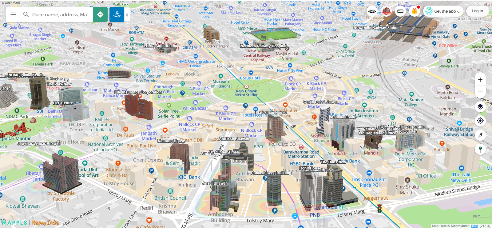
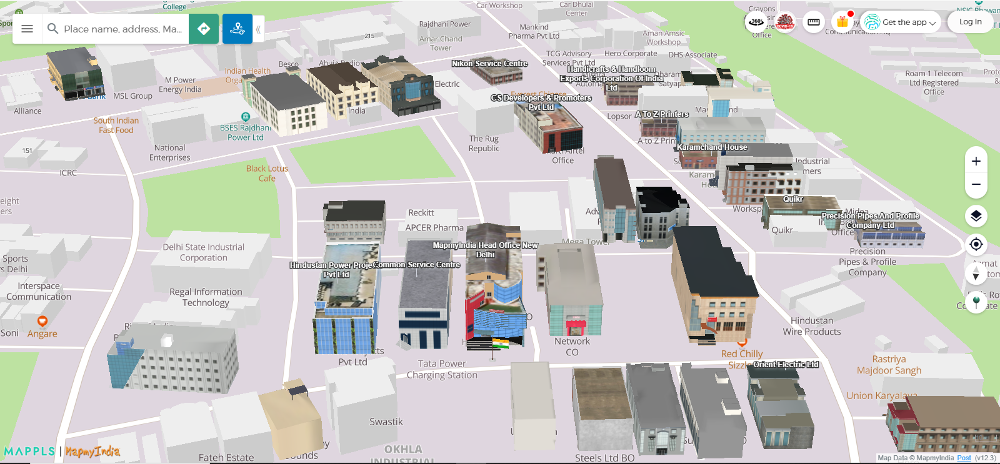

[ </p>](https://about.mappls.com/api)

[< Back to Table of Contents](../../README.md)

# 3d Landmarks on map

The Mappls Map feature known as "3D landmarks" enhances the visibility of specific landmark structures by displaying them as overlays on the map. These structures are presented with textures and offer additional details in their three-dimensional (3D) geometry, as depicted in the provided screenshot. 

For access, you can get your api key from [Mappls Console](https://auth.mappls.com/console)

The feature is compatible with all map styles available with mappls.com.
To know more about available styles, kindly contact apisupport@mapmyindia.com

**This feature is available from version version 3.0**


## **Preview:**

[ </p>](https://about.mappls.com/)

<p align="center">3D Landmarks</p>

[ </p>](https://about.mappls.com/)
<p align="center">3D Landmarks</p>


### 3D Landmark Methods in JS
To add 3d Landmarks on the map

```js
mappls.add3DModel({map:map});
```
To add any specific mappls pin

```js
mappls.add3DModel({map:map,pin:”mmi000”});
```
To remove 3D Landmark Model from map

```js
model.remove();
```

Click here for [3D Landmark Live Demo](https://www.mappls.com/3d@jpssflvf,onjevjlj,lmljvjlaovlsaeoo,l,f,f,f,f,l,f,zdata)


<br>

For any queries and support, please contact: 

[ </p>](https://about.mappls.com/api/)
Email us at [apisupport@mappls.com](mailto:apisupport@mappls.com)


[Support](https://about.mappls.com/contact/)
Need support? contact us!

<br></br>
<br></br>

[<p align="center">  ](https://stackoverflow.com/questions/tagged/mappls-api)[](https://about.mappls.com/blog/)[](https://github.com/Mappls-api)[ </p>](https://www.npmjs.com/org/mapmyindia) 


[<p align="center">  ](https://www.facebook.com/Mapplsofficial)[](https://twitter.com/mappls)[](https://www.linkedin.com/company/mappls/)[](https://www.youtube.com/channel/UCAWvWsh-dZLLeUU7_J9HiOA)


<div align="center">@ Copyright 2022 CE Info Systems Ltd. All Rights Reserved.</div>

<div align="center"> <a href="https://about.mappls.com/api/terms-&-conditions">Terms & Conditions</a> | <a href="https://about.mappls.com/about/privacy-policy">Privacy Policy</a> | <a href="https://about.mappls.com/pdf/mapmyIndia-sustainability-policy-healt-labour-rules-supplir-sustainability.pdf">Supplier Sustainability Policy</a> | <a href="https://about.mappls.com/pdf/Health-Safety-Management.pdf">Health & Safety Policy</a> | <a href="https://about.mappls.com/pdf/Environment-Sustainability-Policy-CSR-Report.pdf">Environmental Policy & CSR Report</a>

<div align="center">Customer Care: +91-9999333223</div>

