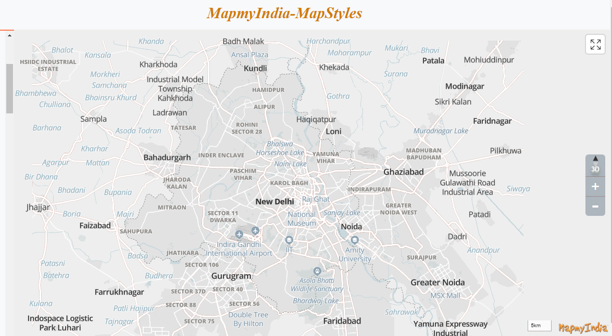

[ </p>](https://www.mapmyindia.com/api)
[< Back to Table of Contents](../../README.md)
# [Set Mappls style](#Set-MapplsMaps-style)

Mappls offers a range of preset styles to rendering the map. The user has to retrieve a list of styles for a specific account. 
The listing api would help in rendering specific style as well as facilitate the switching of style themes. 

From the below reference code it would become quite clear that user has to specify style names and not URLs to use them. 

For access, you can get your api key from [Mappls Console](https://apis.mappls.com/console/)

A default style is set for all account users to start with. 
To know more about available styles, kindly contact apisupport@mapmyindia.com

**This feature is available from version v2.0**

## [List of Available Styles](#list-of-available-styles)

To get the list of available styles follow the below mentioned implementation

**Method to fetch available styles:**

mappls.getStyles();

Click here for [Live Demo](https://www.mapmyindia.com/api/advanced-maps/WebSDK-LiveDemo/map_style)

Mappls Map Styles contains below parameters:

 1. `description(String)`: Description of the style
 2. `displayName(string)`: Generic Name of style mostly used in Mappls content.
 3. `imageUrl(String)`: Preview Image of style
 4. `name(String)`: Name of style used to change the style.

## [Set Mappls Styles](#Set-Mappls-Styles)


To set the Mappls style refer the code below :

**Method:**

mappls.setStyles();

For eg:

```
mappls.setStyle(‘grey-day’);
```
[ </p>](https://about.mappls.com)
<p align="center">Map Styles</p>

That's all!

<br>

For any queries and support, please contact: 

[ </p>](https://about.mappls.com/api/)
Email us at [apisupport@mappls.com](mailto:apisupport@mappls.com)


[Support](https://about.mappls.com/contact/)
Need support? contact us!

<br></br>
<br></br>

[<p align="center">  ](https://stackoverflow.com/questions/tagged/mappls-api)[](https://about.mappls.com/blog/)[](https://github.com/Mappls-api)[ </p>](https://www.npmjs.com/org/mapmyindia) 


[<p align="center">  ](https://www.facebook.com/Mapplsofficial)[](https://twitter.com/mappls)[](https://www.linkedin.com/company/mappls/)[](https://www.youtube.com/channel/UCAWvWsh-dZLLeUU7_J9HiOA)


<div align="center">@ Copyright 2022 CE Info Systems Ltd. All Rights Reserved.</div>

<div align="center"> <a href="https://about.mappls.com/api/terms-&-conditions">Terms & Conditions</a> | <a href="https://about.mappls.com/about/privacy-policy">Privacy Policy</a> | <a href="https://about.mappls.com/pdf/mapmyIndia-sustainability-policy-healt-labour-rules-supplir-sustainability.pdf">Supplier Sustainability Policy</a> | <a href="https://about.mappls.com/pdf/Health-Safety-Management.pdf">Health & Safety Policy</a> | <a href="https://about.mappls.com/pdf/Environment-Sustainability-Policy-CSR-Report.pdf">Environmental Policy & CSR Report</a>

<div align="center">Customer Care: +91-9999333223</div>
