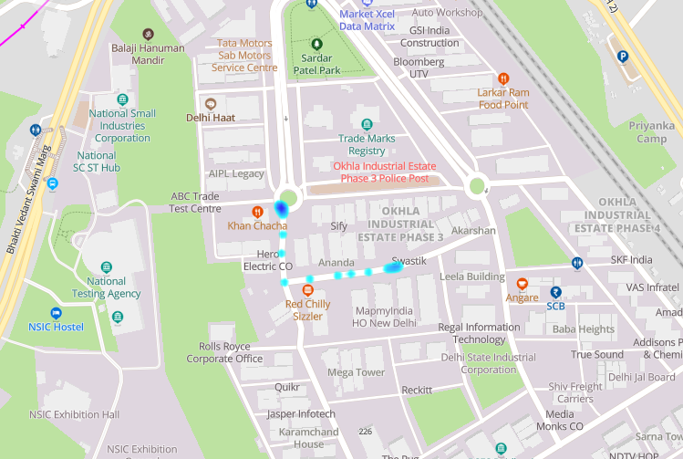

[ </p>](https://www.mapmyindia.com/api)
[< Back to Table of Contents](../../README.md)
# MapmyIndia Interactive Vector Maps JS SDK for Web !

For access, you can get your api key from [Mappls Console](https://auth.mappls.com/console)


## Heat Map Overlay

A heat map is a graphical representation of data where values are depicted as colors. Heat maps are often used to visualize the intensity or density of point data across a map. The color gradient on the map helps users quickly identify areas with higher or lower concentrations of the data. For a heat map, you typically use a color gradient from cool to warm color tones (e.g., blue to red) to represent low to high values.

### Overlaying Heat Maps on map

[ </p>](https://about.mappls.com)
<p align="center">Heat Map</p>

#### [Heatmap Properties](#heatmap-properties)

### *Required*

- **Map**
- **data** This could be be the array of lat lng.

### *Optional Properties*

- **opacity:** Set the opacity of the heatmap overlays.

```js
	{
		opacity: 0.8
	}
```

- **radius:** Set the radius of the heatmap overlays.

```js
	{
		radius: 50
	}
```

- **maxIntensity:** Set the intensity of the heatmap overlays.

```js
	{
		maxIntensity: 50
	}
```

- **fitbounds:** Fit map to layer bounds. By default the value is false

```js
	{
		fitbounds: true
	}
```

- **fitboundOptions:** This shows the options available on the fitBound property.

```js
	{
		fitboundOptions: {padding: 120,duration:1000}
	}
```

- **gradient:** The color gradient of the heatmap, specified as an array of CSS color strings. All CSS3 colors are supported except for extended named colors.

```js
	{
		gradient: [ 'rgba(0, 255, 255, 0)', 'rgba(0, 255, 255, 1)', 'rgba(0, 191, 255, 1)', 'rgba(0, 127, 255, 1)', 'rgba(0, 63, 255, 1)', 'rgba(0, 0, 255, 1)', 'rgba(0, 0, 223, 1)', 'rgba(0, 0, 191, 1)', 'rgba(0, 0, 159, 1)', 'rgba(0, 0, 127, 1)', 'rgba(63, 0, 91, 1)', 'rgba(127, 0, 63, 1)', 'rgba(191, 0, 31, 1)', 'brown' ]               
	}
```


#### HeatmapLayer Method

**`Mappls.HeatmapLayer()`**

```js
	var pts=[{lat: 28.774, lng: 80.190}, {lat: 28.466, lng: 76.118},{lat: 27.321, lng: 77.757}, {lat: 27.774, lng: 80.190}];
	var gradient = ['rgba(0, 255, 255, 0)', 'rgba(0, 255, 255, 1)', 'rgba(0, 191, 255, 1)', 'rgba(0, 127, 255, 1)', 'rgba(0, 63, 255, 1)', 'rgba(0, 0, 255, 1)', 'rgba(0, 0, 223, 1)', 'rgba(0, 0, 191, 1)', 'rgba(0, 0, 159, 1)', 'rgba(0, 0, 127, 1)', 'rgba(63, 0, 91, 1)', 'rgba(127, 0, 63, 1)', 'rgba(191, 0, 31, 1)', 'brown' ]; 
	heat_map=new mappls.HeatmapLayer({
		map:map_object,
		data:pts,
		opacity:1,
		radius:10,
		maxIntensity:10,
		fitbounds:true, // or false
		gradient1:gradient
	});
```

#### Remove HeatMap

```js
	Mappls.remove({map:map,layer:HeatmapLayer});
```

<br>

For any queries and support, please contact: 

[ </p>](https://about.mappls.com/api/)
Email us at [apisupport@mappls.com](mailto:apisupport@mappls.com)


[Support](https://about.mappls.com/contact/)
Need support? contact us!

<br></br>
<br></br>

[<p align="center">  ](https://stackoverflow.com/questions/tagged/mappls-api)[](https://about.mappls.com/blog/)[](https://github.com/Mappls-api)[ </p>](https://www.npmjs.com/org/mapmyindia) 


[<p align="center">  ](https://www.facebook.com/Mapplsofficial)[](https://twitter.com/mappls)[](https://www.linkedin.com/company/mappls/)[](https://www.youtube.com/channel/UCAWvWsh-dZLLeUU7_J9HiOA)


<div align="center">@ Copyright 2022 CE Info Systems Ltd. All Rights Reserved.</div>

<div align="center"> <a href="https://about.mappls.com/api/terms-&-conditions">Terms & Conditions</a> | <a href="https://about.mappls.com/about/privacy-policy">Privacy Policy</a> | <a href="https://about.mappls.com/pdf/mapmyIndia-sustainability-policy-healt-labour-rules-supplir-sustainability.pdf">Supplier Sustainability Policy</a> | <a href="https://about.mappls.com/pdf/Health-Safety-Management.pdf">Health & Safety Policy</a> | <a href="https://about.mappls.com/pdf/Environment-Sustainability-Policy-CSR-Report.pdf">Environmental Policy & CSR Report</a>

<div align="center">Customer Care: +91-9999333223</div>
