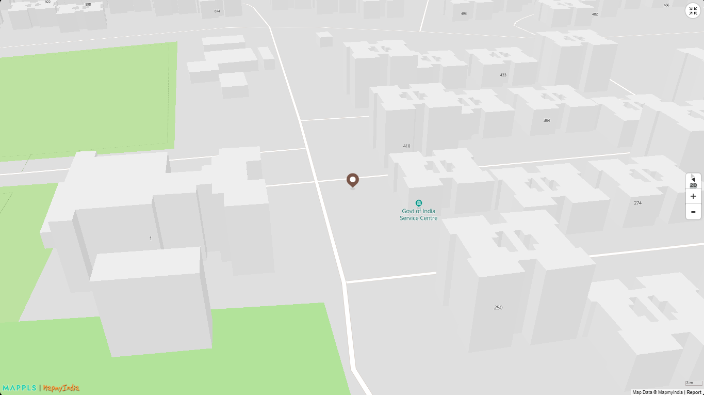

[ </p>](https://www.mapmyindia.com/api)
[< Back to Table of Contents](../../README.md)
# MapmyIndia Interactive Vector Maps JS SDK for Web !

## Markers


Markers are effortless way of pointing to a location, so getting right to it, you can go ahead and add markers that we provide out of the box but just in case you want to add your own, we’ve got that covered for you as well. There are 3 main categories of markers that you can add namely,  
-  **Stock Markers**: The one you get out of the box using our Interactive Vector Maps SDK and you can select from a lot of choices.  
-  **Custom Marker**: Just in case you want to provide your own markers, we’ve handled that for you as well.  
-  **HTML Marker**: In case you don’t want to add in an image you can use HTML to create a marker and then plot it on the map as well.

For access, you can get your api key from [Mappls Console](https://apis.mappls.com/console/)

[ </p>](https://about.mappls.com)
<p align="center">Marker</p>

### Add Markers
Code snippet for adding markers

```js
var marker = new mappls.Marker({
    map: map,
    position: {"lat": 28.519467,"lng":77.223150}
	});
```
#### Code Snippets:

```js
	marker = new mappls.Marker({
			map: object,
			id: id(optional),
			class: class(optional),
			position: {"lat": "28.519467","lng":"77.223150"},
			fitbounds: true, // or false
			fitboundOptions: {padding: 120,duration:1000}, /*if fitbound true*/
			icon: icon(url),
			offset: [0,10],
			width: 35,
			height: 20,
			html: <div style="white-space:nowrap;font-size:10px;padding l					eft:15px;color:#fff">Hello World</div>,
			popupOptions: true, //or false 
			popupHtml: 'Mapmyindia',
			draggable: true, //or false
			clustersOptions: {"color": "blue","bgcolor":"red"},
		})
```

[**Multiple Marker With cluster**](#Multiple-Marker-With-cluster)

[Mappls Live Demo](https://www.mapmyindia.com/api/advanced-maps/WebSDK-LiveDemo/multiple-marker) 

Code snippet for adding multiple marker with cluster

```js
    var geoData={
                "type": "FeatureCollection",
                "features": [{
                "type": "Feature",
                "properties": {"htmlPopup":"noida"},
                "geometry": {"type": "Point",
                "coordinates": [28.544,77.5454]}
                },{
                "type": "Feature",
                "properties": {"htmlPopup":"faridabad"},
                "geometry": {"type": "Point",
                "coordinates": [28.27189158,77.2158203125]}
                },{
                "type": "Feature",
                "properties": {"htmlPopup":"delhi"},
                "geometry": {"type": "Point",
                "coordinates": [28.549511,77.2678250]}
                }]
            };
    var marker=Mappls.Marker({map:map,position:geoData,icon_url:'https://apis.mapmyindia.com/map_v3/1.png',clusters:true,fitbounds:true,fitboundOptions:{padding: 120,duration:1000},popupOptions:{offset: {'bottom': [0, -20]}}});
```

### GeoJSON bulk Markers

[Mappls Live Demo](https://www.mapmyindia.com/api/advanced-maps/WebSDK-LiveDemo/addgeojson)

Code snippet for adding geojson bulk markers
```js
	var geoData={
				"type": "FeatureCollection",
				"features": [{
				"type": "Feature",
				"properties":
					{
						"description":"noida",
						"icon":"https://apis.mapmyindia.com/map_v3/1.png",
						"icon-size":.75,
						"icon-offset":[0,-10],
						"text":"1",
						"text-size":10,
						"text-offset":[0,.6]
				},
				"geometry": {"type": "Point",
				"coordinates": [28.544,77.5454]}
				},{
				"type": "Feature",
				"properties": {"description":"faridabad","icon":"https://apis.mapmyindia.com/map_v3/1.png"},
				"geometry": {"type": "Point",
				"coordinates": [28.27189158,77.2158203125]}
				},{
				"type": "Feature",
				"properties": {"description":"delhi","icon":"https://apis.mapmyindia.com/map_v3/1.png"},
				"geometry": {"type": "Point",
				"coordinates": [28.549511,77.2678250]}
				}]
			};
	var marker=mappls.addGeoJson({map:map,data:geoData,fitbounds:true,cType:0});
```


### Remove Markers

**`mappls.remove()`**

```js
	mappls.remove({map: map_object, layer: marker_object});
```


<br>

For any queries and support, please contact: 

[ </p>](https://about.mappls.com/api/)
Email us at [apisupport@mappls.com](mailto:apisupport@mappls.com)


[Support](https://about.mappls.com/contact/)
Need support? contact us!

<br></br>
<br></br>

[<p align="center">  ](https://stackoverflow.com/questions/tagged/mappls-api)[](https://about.mappls.com/blog/)[](https://github.com/Mappls-api)[ </p>](https://www.npmjs.com/org/mapmyindia) 


[<p align="center">  ](https://www.facebook.com/Mapplsofficial)[](https://twitter.com/mappls)[](https://www.linkedin.com/company/mappls/)[](https://www.youtube.com/channel/UCAWvWsh-dZLLeUU7_J9HiOA)


<div align="center">@ Copyright 2022 CE Info Systems Ltd. All Rights Reserved.</div>

<div align="center"> <a href="https://about.mappls.com/api/terms-&-conditions">Terms & Conditions</a> | <a href="https://about.mappls.com/about/privacy-policy">Privacy Policy</a> | <a href="https://about.mappls.com/pdf/mapmyIndia-sustainability-policy-healt-labour-rules-supplir-sustainability.pdf">Supplier Sustainability Policy</a> | <a href="https://about.mappls.com/pdf/Health-Safety-Management.pdf">Health & Safety Policy</a> | <a href="https://about.mappls.com/pdf/Environment-Sustainability-Policy-CSR-Report.pdf">Environmental Policy & CSR Report</a>

<div align="center">Customer Care: +91-9999333223</div>
