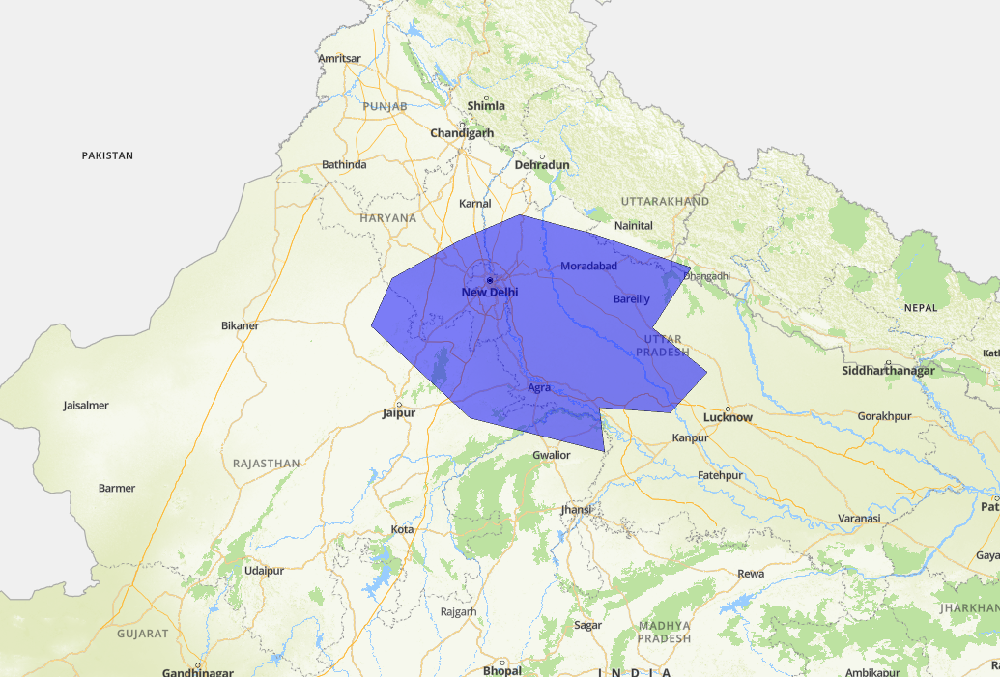

[ </p>](https://about.mappls.com/api)
[< Back to Table of Contents](../../README.md)
# MapmyIndia Interactive Vector Maps JS SDK for Web !

## Polygon
For access, you can get your api key from [Mappls Console](https://auth.mappls.com/console)


### Drawing Polygon
```js
new mappls.Polygon
```

[ </p>](https://about.mappls.com)
<p align="center">Polygon</p>

#### [Polygon Properties](#polygon-properties)

### *Required*

- **Map**
- **Path:** This could be be the array of lat lng.

### Code Snippets

```js
	mappls_polygon = new mappls.Polygon({
		map: map,
		paths: [{"lng":"77.26872","lat": "28.55101"},
			{"lng":"77.26849","lat":"28.55099"},{"lng":"77.26831","lat":"28.55097"},
			{"lng":"77.26794","lat":"28.55093"},{"lng":"77.2676","lat":"28.55089"},
			{"lng":"77.26756","lat":"28.55123"},{"lng":"77.26758","lat":"28.55145"},
			{"lng":"77.26758","lat":"28.55168"},{"lng":"77.26759","lat":"28.55172"}]
	});
```

### *Optional Properties*

- **fillcolor:** Fills the color of the polygon and All CSS3 colors are supported except for extended named colors.

```js
	{
		fillcolor: "red"
	}
```

- **fillOpacity:** Fills the opacity of the polygon.

```js
	{
		fillOpacity: 0.8
	}
```

- **strokeColor:** Fills the Stroke color of the polygon.

```js
	{
		strokeColor: "blue"
	}
```

- **strokeOpacity:** Fills the Stroke opacity of the polygon.

```js
	{
		strokeOpacity: "black"
	}
```

- **fitbounds:** Fits in the map layer automatically to a bound on which geoJson has made.

```js
	{
		fitbounds: true
	}
```

- **fitboundOptions:** This shows the options aailable on the fitBound property.

```js
	{
		fitboundOptions: {padding: 120,duration:1000}
	}
```

- **popupHtml:** This shows the message you want to print while clicking on the polygon.

```js
	{
		popupHtml: 'Route 1'
	}
```

- **popupOptions:** Options available in printing the message through popupHtml.

```js
	{
		popupOptions: {offset: {'bottom': [0, -20]}}
	}
```


## Example - Code Snippets

```js
	mappls_polygon = new mappls.Polygon({
		map: map,
		paths: [{"lng":"77.26872","lat": "28.55101"},
			{"lng":"77.26849","lat":"28.55099"},{"lng":"77.26831","lat":"28.55097"},
			{"lng":"77.26794","lat":"28.55093"},{"lng":"77.2676","lat":"28.55089"},
			{"lng":"77.26756","lat":"28.55123"},{"lng":"77.26758","lat":"28.55145"},
			{"lng":"77.26758","lat":"28.55168"},{"lng":"77.26759","lat":"28.55172"}],
		fillColor: "red",
		fillOpacity: 0.8,
		strokeColor: "red",
		strokeOpacity: 0.8,
		fitbounds: true
		fitboundOptions: {padding: 120,duration:1000},
		popupHtml: 'Route 1',
		popupOptions: {offset: {'bottom': [0, -20]}}
	});
```

#### Remove Polygon

```js
	mappls.remove({map: map_object, layer: Polygon_object);
```

## Polygon Events

#### click

```js
	Polygon_object.addListener(('click')), function() {
			alert(`Click Event Works`);
	});
```

#### dblclick

```js
	Polygon_object.addListener(('dblclick')), function() {
			alert(`Double Click Event Works`);
	});
```

#### drag

```js
	Polygon_object.addListener(('drag')), function() {
			alert(`Drag Event Works`);
	});
```

#### dragstart

```js
	Polygon_object.addListener(('dragstart')), function() {
			alert(`Drag Start Event Works`);
	});
```

#### dragend

```js
	Polygon_object.addListener(('dragend')), function() {
			alert(`Dragend Event Works`);
	});
```

#### mousemove

```js
	Polygon_object.addListener(('mousemove')), function() {
			alert(`Mouse Move Event Works`);
	});
```

#### mouseover

```js
	Polygon_object.addListener(('mouseover')), function() {
			alert(`Mouse Over Event Works`);
	});
```


<br>

For any queries and support, please contact: 

[ </p>](https://about.mappls.com/api/)
Email us at [apisupport@mappls.com](mailto:apisupport@mappls.com)


[Support](https://about.mappls.com/contact/)
Need support? contact us!

<br></br>
<br></br>

[<p align="center">  ](https://stackoverflow.com/questions/tagged/mappls-api)[](https://about.mappls.com/blog/)[](https://github.com/Mappls-api)[ </p>](https://www.npmjs.com/org/mapmyindia) 


[<p align="center">  ](https://www.facebook.com/Mapplsofficial)[](https://twitter.com/mappls)[](https://www.linkedin.com/company/mappls/)[](https://www.youtube.com/channel/UCAWvWsh-dZLLeUU7_J9HiOA)


<div align="center">@ Copyright 2022 CE Info Systems Ltd. All Rights Reserved.</div>

<div align="center"> <a href="https://about.mappls.com/api/terms-&-conditions">Terms & Conditions</a> | <a href="https://about.mappls.com/about/privacy-policy">Privacy Policy</a> | <a href="https://about.mappls.com/pdf/mapmyIndia-sustainability-policy-healt-labour-rules-supplir-sustainability.pdf">Supplier Sustainability Policy</a> | <a href="https://about.mappls.com/pdf/Health-Safety-Management.pdf">Health & Safety Policy</a> | <a href="https://about.mappls.com/pdf/Environment-Sustainability-Policy-CSR-Report.pdf">Environmental Policy & CSR Report</a>

<div align="center">Customer Care: +91-9999333223</div>
