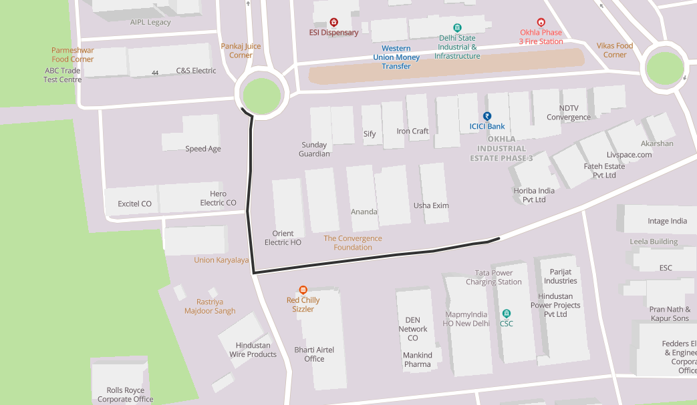

[ </p>](https://about.mappls.com/api)
[< Back to Table of Contents](../../README.md)
# MapmyIndia Interactive Vector Maps JS SDK for Web !

## Polyline Quick Reference

[ </p>](https://about.mappls.com)
<p align="center">Polyline</p>

#### [Polyline Properties](#Polyline-Properties)

### *Required*

- **Map Object**
- **Path:** 

This could be be the array of lat lng.
For access, you can get your api key from [Mappls Console](https://auth.mappls.com/console)

**Example Code Snippets:**

```js
    Var polyline =new mappls.polyline({
		map:map,
		path: [{lat:28.55108, lng:77.26913},{lat:28.55106,lng: 77.26906},{lat:28.55105,lng: 77.26897},{lat:28.55101,lng:77.26872},{lat:28.55099, lng:77.26849},{lat:28.55097, lng:77.26831},{lat:28.55093, lng:77.26794},{lat:28.55089, lng:77.2676},{lat:28.55123, lng:77.26756},{lat:28.55145, lng:77.26758},{lat:28.55168, lng:77.26758},{lat:28.55175, lng:77.26759},{lat:28.55177, lng:77.26755},{lat:28.55179, lng:77.26753}],
        });
```

### *Optional Properties*

- **strokeColor:** The polyline's stroke color. All CSS3 colors are supported except for extended named colors.

```js
	{
		strokeColor: '#333'
	}
```

- **strokeOpacity:** The stroke color opacity can be set using this property. All CSS3 colors are supported except for extended named colors.

```js
	{
		strokeOpacity: 1.0
	}
```

- **strokeWeight:** The stroke color density can be definded using this property. All CSS3 colors are supported except for extended named colors.

```js
	{
		strokeWeight: 5
	}
```

- **fitbounds:** Automatically adjusts the map layer to fit within the boundaries defined by the GeoJSON data/or other layer parameters. By default the value is false.

```js
	{
		fitbounds: true
	}
```

- **fitboundOptions:** Make map fit to polyline cordinates. By default the value is false.

```js
	{
		fitboundOptions: {padding: 120,duration:1000}
	}
```

- **lineCap:** The display of line endings. One of "butt", "round", "square". Defaults to "butt".

```js
	{
		lineCap: {padding: 120,duration:1000}
	}
```

- **popupHtml:** It shows the message on clicking the polyline.

```js
	{
		popupHtml: "MapmyIndia"
	}
```

- **popupOptions:** Various options to show the message on clicking the polyline.

```js
	{
		popupOptions: {offset: {'bottom': [0, -20]}}
	}
```

- **zIndex:** Decides the priority index of the polyline.

```js
	{
		zIndex: 5
	}
```

- **visibility:** Decides whether to show the Polyline or not. By default the value is `true`.

```js
	{
		visibility: false
	}
```

**Example Code Snippet**

```js
Polyline = new mappls.Polyline({
	map: map,
	path: [{lat:28.55108, lng:77.26913},{lat:28.55106,lng: 77.26906},
	{lat:28.55105,lng: 77.26897},{lat:28.55101,lng:77.26872},
	{lat:28.55099,lng:77.26849},{lat:28.55097, lng:77.26831},
	{lat:28.55093,lng:77.26794},{lat:28.55089, lng:77.2676},
	{lat:28.55123, lng:77.26756},{lat:28.55145, lng:77.26758},
	{lat:28.55168, lng:77.26758},{lat:28.55175, lng:77.26759},
	{lat:28.55177, lng:77.26755},{lat:28.55179, lng:77.26753},
	{lat:28.55182, lng:77.26751},{lat:28.55185, lng:77.2675},
	{lat:28.5519, lng:77.2675},{lat:28.55193, lng:77.2675},
	{lat:28.55195, lng:77.26752}],
	strokeColor: red,
	strokeOpacity: 1.0,
	strokeWeight: 9,
	fitbounds: true,
	lineGap: 0,
	fitboundOptions: {padding: 120,duration:1000},
	popupHtml: "Route 1",
	popupOptions: {offset: {'bottom': [0, -20]}}
});
```

#### [Editable Polyline](#Editable-Polyline)

*Drag polyline from anywhere & get callback polyline data.*

```js
    var pts=[{lat:28.55108, lng:77.26913},{lat:28.55106,lng: 77.26906},{lat:28.55105,lng: 77.26897},{lat:28.55101,lng:77.26872},{lat:28.55099, lng:77.26849},{lat:28.55097, lng:77.26831},{lat:28.55093, lng:77.26794},{lat:28.55089, lng:77.2676},{lat:28.55123, lng:77.26756},{lat:28.55145, lng:77.26758},{lat:28.55168, lng:77.26758},{lat:28.55175, lng:77.26759},{lat:28.55177, lng:77.26755},{lat:28.55179, lng:77.26753}];
    var polyline = new mappls.Polyline({
        map:map,
        paths: pts,
        strokeColor: '#333',
        strokeOpacity: 1.0,
        strokeWeight: 10,
        fitbounds:true,
		editable: true
    });
```

#### [Gradient Polyline](#Gradient-Polyline)

[Mappls Gradient Polyline Live Demo](https://about.mappls.com/api/web-sdk/vector-map-auth2/Polyline/mappls-gradient-polyline)
```js
    var pts=[{lat:28.55108, lng:77.26913},{lat:28.55106,lng: 77.26906},{lat:28.55105,lng: 77.26897},{lat:28.55101,lng:77.26872},{lat:28.55099, lng:77.26849},{lat:28.55097, lng:77.26831},{lat:28.55093, lng:77.26794},{lat:28.55089, lng:77.2676},{lat:28.55123, lng:77.26756},{lat:28.55145, lng:77.26758},{lat:28.55168, lng:77.26758},{lat:28.55175, lng:77.26759},{lat:28.55177, lng:77.26755},{lat:28.55179, lng:77.26753}];
    var polyline = new mappls.Polyline({
        map:map,
        paths: pts,
        strokeColor: '#333',
        strokeOpacity: 1.0,
        strokeWeight: 10,
        fitbounds:true,
        gradient:[0, 'pink',0.1, 'black',0.3, 'cyan',0.5, 'lime',0.7, 'yellow',1, 'red']
    });
```

#### [Animated Polyline](#Animated-Polyline)

[Animated Polyline Live Demo](https://about.mappls.com/api/web-sdk/vector-map-auth2/Polyline/mappls-animated-polyline) 

*Polyline draw point by point with speed*

```js
    var pts=[{lat:28.55108, lng:77.26913},{lat:28.55106,lng: 77.26906},{lat:28.55105,lng: 77.26897},{lat:28.55101,lng:77.26872},{lat:28.55099, lng:77.26849},{lat:28.55097, lng:77.26831},{lat:28.55093, lng:77.26794},{lat:28.55089, lng:77.2676},{lat:28.55123, lng:77.26756},{lat:28.55145, lng:77.26758},{lat:28.55168, lng:77.26758},{lat:28.55175, lng:77.26759},{lat:28.55177, lng:77.26755},{lat:28.55179, lng:77.26753}];
    var polyline = new mappls.Polyline({
        map:map,
        paths: pts,
        strokeColor: '#333',
        strokeOpacity: 1.0,
        strokeWeight: 10,
        fitbounds:true,
        animate: {path:true/false,speed:5}
    });
```

#### [Animated Marker Along With Polyline](#Animated-Marker-Along-With-Polyline)

```js
    var pts=[{lat:28.55108, lng:77.26913},{lat:28.55106,lng: 77.26906},{lat:28.55105,lng: 77.26897},{lat:28.55101,lng:77.26872},{lat:28.55099, lng:77.26849},{lat:28.55097, lng:77.26831},{lat:28.55093, lng:77.26794},{lat:28.55089, lng:77.2676},{lat:28.55123, lng:77.26756},{lat:28.55145, lng:77.26758},{lat:28.55168, lng:77.26758},{lat:28.55175, lng:77.26759},{lat:28.55177, lng:77.26755},{lat:28.55179, lng:77.26753}];
    var polyline = new mappls.Polyline({
        map:map,
        paths: pts,
        strokeColor: '#333',
        strokeOpacity: 1.0,
        strokeWeight: 10,
        fitbounds:true,
        animate: { 
        speed:5 
        icon_width: 35 / “35”,
        icon_height: 15 / “15”,,
        icon_url: (icon_url),
        repeat: true/false,
    	},
    });
```

#### [Multi Colored Polyline](#Multi-Colored-Polyline)

[Multi Colored Polyline Live Demo](https://about.mappls.com/api/web-sdk/vector-map-auth2/Polyline/mappls-multicolored-polyline) 

```js
	Polyline = new mappls.Polyline({
		map: map,
		path: {
				"type": "FeatureCollection",
				"features": [{
					"type": "Feature",
					"properties": {
						"color": "green" 
						},
					"geometry": {
						"type": "LineString",
							"coordinates": [[28.55101,77.26872],[28.55099,77.26849],
							[28.55097,77.26831],[28.55093, 77.26794],
							[28.55089,77.2676],[28.55123,77.26756]]
						}
					},
					{
					"type": "Feature",
					"properties": {
						"color": "#F7455D" 
						},
					"geometry": {
						"type": "LineString",
							"coordinates": [[28.55123,77.26756],[28.55145,77.26758],
							[28.55168,77.26758],[28.55168,77.26758],
							[28.55168,77.26758],[28.55172,77.26759]]
						}
					}]
				},
		strokeColor: red,
		strokeOpacity: 1.0,
		strokeWeight: 9,
		fitbounds: true, // or false
		lineGap: 0,
		fitboundOptions: {padding: 120,duration:1000},
		popupHtml: "Route 1",
		popupOptions: {offset: {'bottom': [0, -20]}}
	});
```

#### [Polyline Marker Animation Methods](#polyline-marker-animation-methods)

##### Stop Animation

```js
	polyline.animate('stop');
```

##### Resume Animation

```js
	polyline.animate('resume');
```

### [Polyline Events](#polyline-events)

#### click

```js
	Polyline.addListener(('click')), function() {
			alert(`Polyline Event Works`);
	});
```

#### dblclick

```js
	Polyline.addListener(('dblclick')), function() {
			alert(`Polyline Event Works`);
	});
```

#### drag

```js
	Polyline.addListener(('drag')), function() {
			alert(`Polyline Event Works`);
	});
```

#### dragstart

```js
	Polyline.addListener(('dragstart')), function() {
			alert(`Polyline Event Works`);
	});
```

#### dragend

```js
	Polyline.addListener(('dragend')), function() {
			alert(`Polyline Event Works`);
	});
```

#### mousemove

```js
	Polyline.addListener(('mousemove')), function() {
			alert(`Polyline Event Works`);
	});
```

#### mouseout

	```js
	Polyline.addListener(('mouseout')), function() {
			alert(`Polyline Event Works`);
	});
	```


<br>

For any queries and support, please contact: 

[ </p>](https://about.mappls.com/api/)
Email us at [apisupport@mappls.com](mailto:apisupport@mappls.com)


[Support](https://about.mappls.com/contact/)
Need support? contact us!

<br></br>
<br></br>

[<p align="center">  ](https://stackoverflow.com/questions/tagged/mappls-api)[](https://about.mappls.com/blog/)[](https://github.com/Mappls-api)[ </p>](https://www.npmjs.com/org/mapmyindia) 


[<p align="center">  ](https://www.facebook.com/Mapplsofficial)[](https://twitter.com/mappls)[](https://www.linkedin.com/company/mappls/)[](https://www.youtube.com/channel/UCAWvWsh-dZLLeUU7_J9HiOA)


<div align="center">@ Copyright 2022 CE Info Systems Ltd. All Rights Reserved.</div>

<div align="center"> <a href="https://about.mappls.com/api/terms-&-conditions">Terms & Conditions</a> | <a href="https://about.mappls.com/about/privacy-policy">Privacy Policy</a> | <a href="https://about.mappls.com/pdf/mapmyIndia-sustainability-policy-healt-labour-rules-supplir-sustainability.pdf">Supplier Sustainability Policy</a> | <a href="https://about.mappls.com/pdf/Health-Safety-Management.pdf">Health & Safety Policy</a> | <a href="https://about.mappls.com/pdf/Environment-Sustainability-Policy-CSR-Report.pdf">Environmental Policy & CSR Report</a>

<div align="center">Customer Care: +91-9999333223</div>
